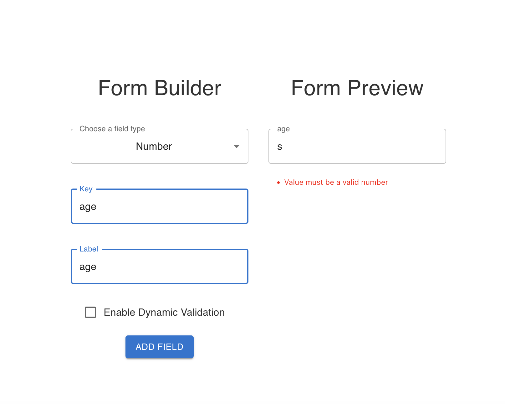
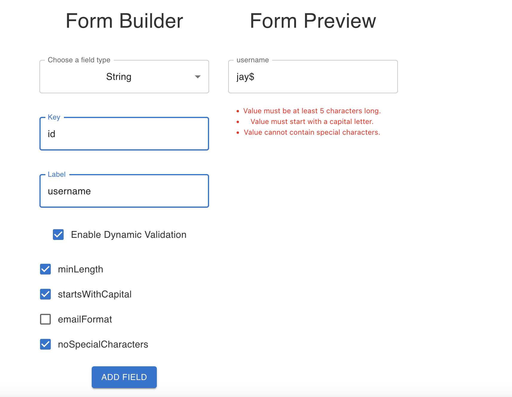
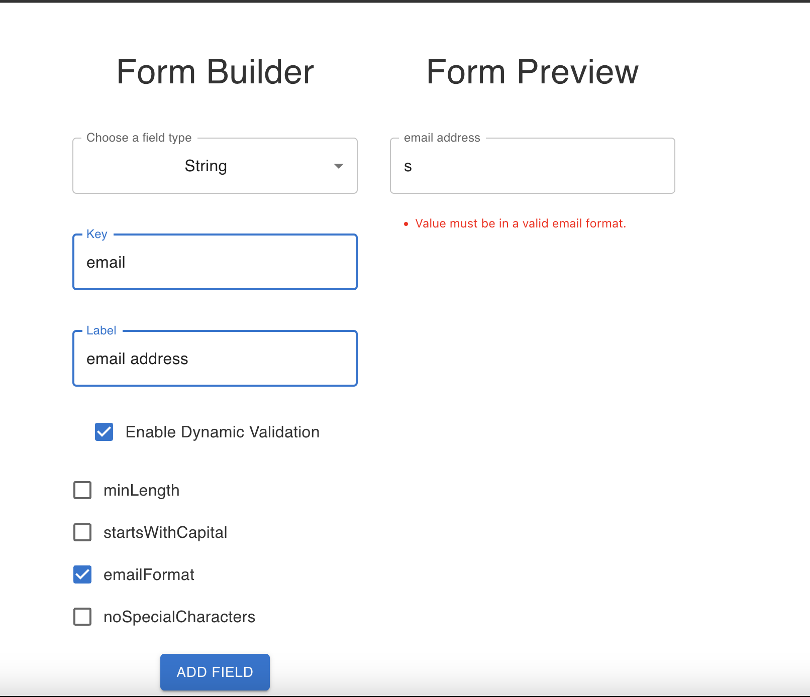

# Form Builder

# Overview

The assignment focuses on enhancing an existing form builder application by implementing field input validation and dynamic validation settings.

## Task 1: Field Input Validation

### Approach : 

The first task involves implementing input validation for each field based on its assigned type. The validation should trigger upon the blur event on each field.

### Solution :

- Custom validation rules were developed for field types, such as "Number".
- The `validateFieldValue` function was employed to manage and execute validation logic.
- Redux was integrated to effectively manage the application's state and streamline error handling.

### Rationale :

- The validation logic was centralized, ensuring a consistent and scalable approach to error management.
- The implementation of Redux facilitated a well-structured error management system, simplifying error handling and display.

## Task 2: Dynamic Validation Setting

### Approach :

The second task focuses on introducing a flexible feature that allows users to define their own validation rules through the application interface. This dynamic validation capability should be adaptable to various rules without necessitating extensive changes to the existing codebase.

### Solution :

- Users have the ability to select dynamic validation rules for individual fields directly from the user interface.
- A `validationRules` configuration was introduced, mapping rule names to corresponding validation functions.
- The `validateFieldValue` function was enhanced to accommodate dynamic validation rules.
- An innovative approach was developed to enable dynamic rule-setting while minimizing codebase modifications.

### Rationale :

- A configuration-based approach was adopted to ensure scalability without compromising the integrity of existing code.
- The design facilitated straightforward integration of new validation rules by expanding the `validationRules` object.

## Validation Screenshots

Here are some screenshots showcasing different validation scenarios :

### Incorrect Data Type Validation

### Dynamic Validation Rule

### Email Format Validation

